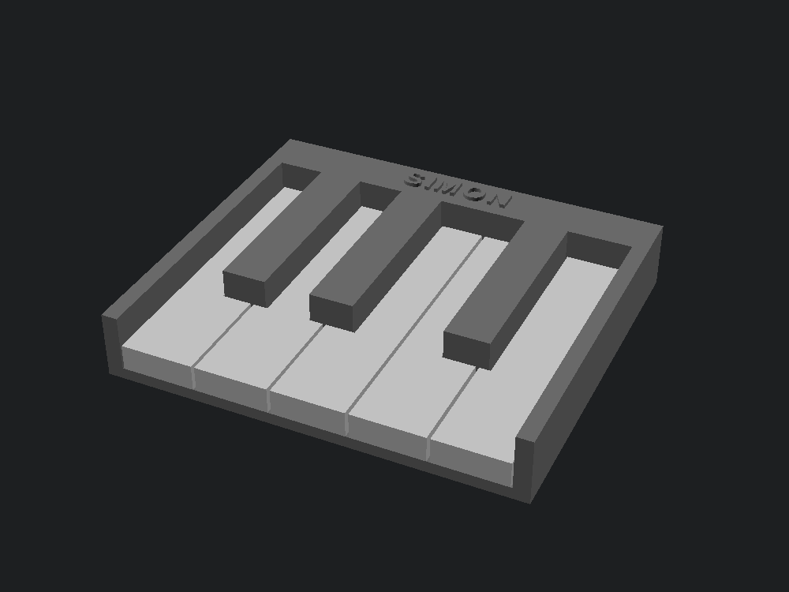
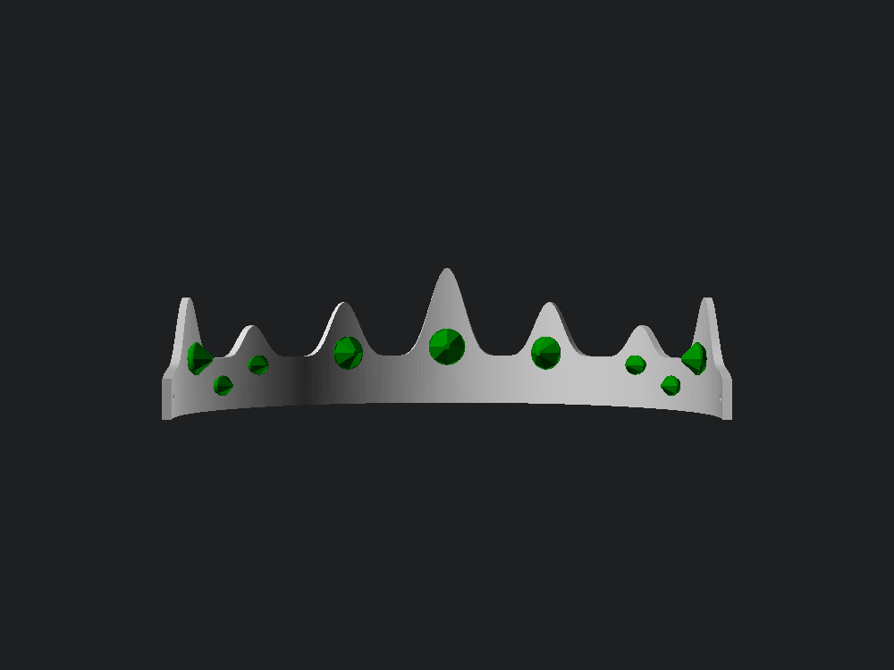
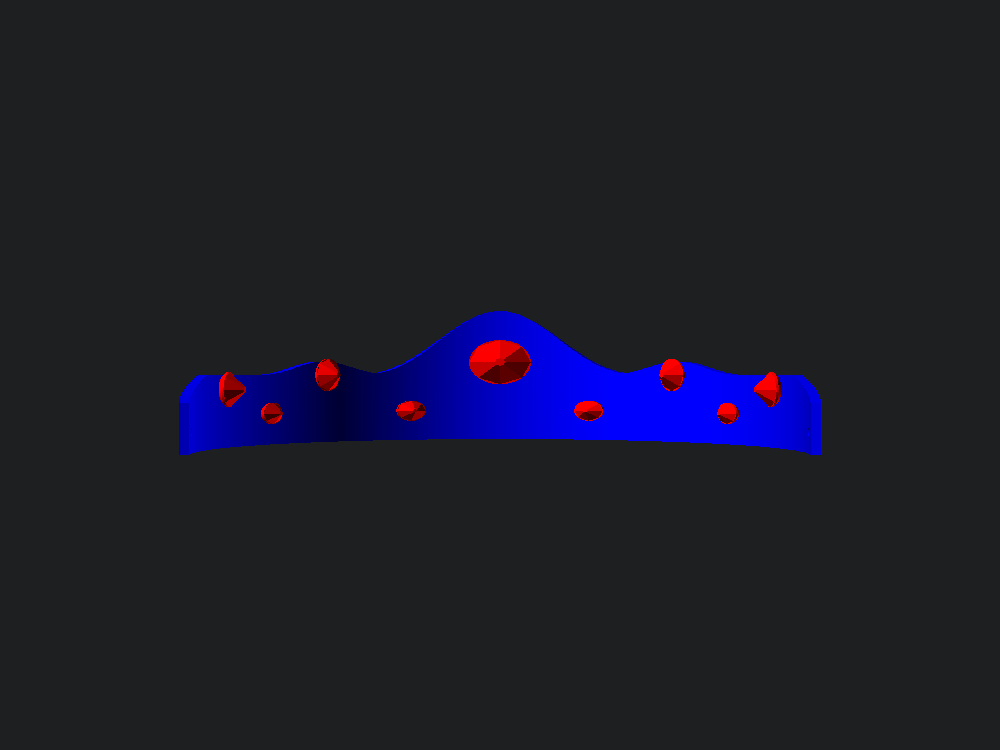
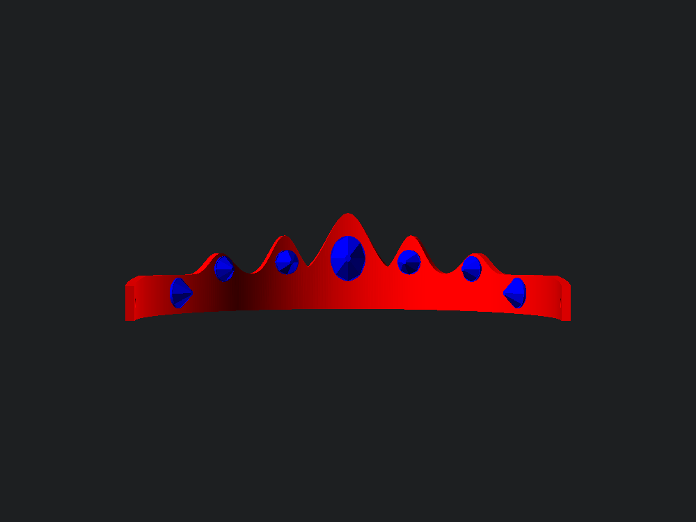

# Cousin Camp 2026 gifts

Welcome gifts for four kids: a crown, a diadem, a tiara, and a five-finger piano keyboard.

The three headpieces come out of one parametric OpenSCAD engine — `design` picks the
silhouette and `head_circ` sizes it. The piano is its own model.

Sizes below use placeholder head circumferences. Measure the actual head with a soft tape
and put the real numbers in an untracked `recipients.local.sh`; see [Recipients](#recipients).

| | Crown | Diadem | Tiara |
|---|---|---|---|
| Body colour | silver | blue | red |
| Gem colour | green | red | blue |
| Head circumference | 550 mm | 570 mm | 500 mm |
| Peak height | 46 mm | 40 mm | 38 mm |
| Band height | 16 mm | 20 mm | 14 mm |
| Wall, base → tip | 2.6 → 1.7 mm | 2.6 → 1.8 mm | 2.9 → 2.1 mm |
| Stones | 9 | 9 | 7 |

Detail tracks the age of the wearer. The crown is the tallest and busiest piece and suits
the oldest; the diadem's broad arch is the sturdiest form here; the tiara's spire is
shorter, wider and blunter on a thicker wall, with fewer and larger stones, because a tall
narrow spike is the wrong thing to hand a young child — it snaps across the layer lines and
it sits near the face.

## Piano keyboard



C D E F G with C#, D# and F#: a real pentascale, and the first hand position a beginner
learns. Key width is **true piano scale** at 23.5 mm, because that is the whole point — a
hand goes down on it in real five-finger position. Key length is shortened to 95 mm; a real
145 mm white key would have doubled the print for nothing.

Two prints, two colours, no MMU. The **chassis** is black and carries the bed, the cheeks,
the back rail and all three sharps — the sharps are the same colour as the chassis, so
making them part of it turns a nine-piece assembly into two prints. The five **naturals**
are silver and press onto pegs in the bed.

Sharp placement is not evenly spaced, and getting it wrong is the thing that makes a
printed keyboard look off. Within the C–D–E group three white tails share whatever width
two sharps leave; within F–G–A–B it is four tails and three sharps. Only F# of the second
group appears here, which is why E and F sit adjacent with no black key between them.

### The nameplate is one colour change

The `label` text is raised on the top of the back rail, where a piano puts its maker's
name, and it is deliberately **the only geometry above `rail_z`**. `rail_z` is 20.6 mm, an
exact multiple of 0.2 mm, so a single colour change on that layer boundary in PrusaSlicer
renders the name in silver to match the keys — one tool swap, essentially no purge,
everything below stays black. Skip the colour change and it still prints fine, just black
on black.

`label` defaults to `PIANO`. Set it to the recipient's name at build time:

```bash
openscad -o out/piano-chassis.stl -D 'part="chassis"' -D 'label="NAME"' piano.scad
```

## The headpieces





## Heads are ellipses

This is the reason the design exists rather than a rescaled download. Every guide to
resizing a crown says `scale % = desired inner diameter ÷ current inner diameter`, which
silently assumes a circular head. At a cephalic index of 0.78, a 552 mm head is about
197 mm front-to-back and 154 mm side-to-side. A rigid circular ring sized to `C / π` comes
out at 176 mm — some 20 mm too short to pass over the head. Scale it until it clears and
the circumference overshoots by about 67 mm.

`solve_a()` bisects for the ellipse semi-axis that gives the measured circumference using
Ramanujan's perimeter approximation. All three pieces are open at the back with 3.2 mm
ribbon holes, so they tie on and tolerate the cephalic index being a population average
rather than a measurement.

## Why the gems are separate parts

Colour that varies vertically through a part means an MMU tool change on every affected
layer — hundreds of them, plus purge waste, on parts that take forty minutes each. Printing
the stones as press-fit inserts turns six multi-material prints into six single-colour
prints with **zero filament swaps**, since each job just selects an extruder.

Each stone is a straight 7.7 mm plug in an 8.0 mm hole with four 0.35 mm crush ribs. A
tapered plug wedges at an unpredictable depth and leaves the stone standing proud; a
straight plug with ribs seats flush. The ribs ramp from flush to full height over the first
0.6 mm so the gem enters square.

**That interference is uncalibrated for this printer.** It is the first number to adjust if
the stones are tight or loose.

Gem scaling splits three ways, which is not obvious: footprint scales with `gem_w`/`gem_h`,
plug depth is absolute so small stones still reach through the band wall, and facet height
follows the *smaller* dimension so a 7 × 4.5 accent stays flat instead of protruding as far
as the focal stone.

## Printing

No supports anywhere. The whole part is a vertical wall following an elliptical arc, so
there is no overhang; the points come from cosine bumps, which have zero slope at the apex
and so never come to an actual sharp tip.

**Use a brim.** These stand 40 mm tall on a roughly 2.6 mm curved footprint, and the gems
land on small plug faces.

Print in this order. The two cheapest jobs come first so the press fit can be tested on the
tiara's set — about fifty minutes in — before the remaining five hours are committed.

| # | File | Slot | Time | Filament |
|---|---|---|---|---|
| 1 | `gems-tiara-blue` | 2 blue | 12m 56s | 2.9 g |
| 2 | `crown-tiara-red` | 1 red | 36m 58s | 12.7 g |
| 3 | `gems-diadem-red` | 1 red | 13m 22s | 2.7 g |
| 4 | `crown-diadem-blue` | 2 blue | 45m 31s | 18.6 g |
| 5 | `gems-crown-green` | 4 green | 13m 03s | 2.8 g |
| 6 | `crown-crown-silver` | 3 silver | 45m 12s | 16.5 g |
| 7 | `piano-keys-silver` | 3 silver | 1h 04m 18s | 34.8 g |
| 8 | `piano-chassis-black` | 5 black | 1h 52m 19s | 71.2 g |

**5 h 44 m and 162 g total**, 0.20 mm layers in PLA on an MK4 with MMU3. The piano is the
expensive half: on its own it is more time and twice the filament of all three headpieces
combined. Largest footprint is the diadem at 163 × 122 mm. Those numbers came from the
measured sizes, so they will shift slightly with different head circumferences.

### The chassis in PETG

`8-piano-chassis-black-PETG.bgcode` is the same chassis sliced from black PETG in slot 5,
at **2 h 07 m and 72.9 g** — about fifteen minutes and two grams more than the PLA version.
Build it with `material="PETG"`; `./build.sh` emits both.

PETG is the better material for this part. The sharps stand 17 mm off the bed on a 13.7 mm
footprint and are the obvious thing to snap, and PETG's layer adhesion is what keeps them
attached when a small child plays the thing rather than looks at it.

It needs different pegs, though, and not because of shrinkage. PETG lays a wider bead, so a
peg modelled at 4.7 mm comes off the bed fatter. More importantly it is ductile: a PLA rib
shaves down to size going in, where a PETG rib folds over and keeps pushing outward — into
a key that is still brittle PLA. So the PETG chassis drops the peg to 4.55 mm and the ribs
to 0.2 mm, taking 0.35 mm out of the modelled interference. The hole does not move; **the
keys are unchanged and print in PLA either way**, so `7-piano-keys-silver` is still correct.

Two consequences worth knowing before the print starts:

- **The nameplate colour change is PLA-only.** Swapping to silver PLA at Z 20.6 mm would
  feed PLA through a 240 °C nozzle over an 85 °C bed, which jams instead of printing. On a
  PETG chassis the nameplate stays black on black unless there is silver PETG to change to.
- **If slot 5 holds PETG, the PLA chassis g-code is stale.** It would run PETG at PLA
  temperatures. Delete it from the drive, or reload PLA before using it.

Still no brim. PETG's problem on smooth PEI is that it grips too hard, not too little, and
a 127.5 × 110 mm flat base does not need help staying down. Use a glue stick as a *release*
layer so the part does not take PEI with it.

Every file is bound to its slot in the g-code, so there are no filament swaps and nothing
to set at the printer — load the drive and print them in order. Headpieces carry a 4 mm
brim because they stand 40 mm tall on a roughly 2.6 mm curved footprint and the gems land
on small plug faces; the piano has a broad flat base and does not need one.

```bash
slice out/crown-diadem.stl --extruder 2 --brim 4 --out gcode
slice out/piano-chassis-petg.stl --mmu --material PETG --extruder 5 --out gcode
```

The one thing still worth doing in the GUI: the nameplate prints black-on-black as-is.
Adding a colour change at Z 20.6 mm (layer 103) in the preview makes it silver to match the
keys, for one tool swap and essentially no purge.

Needs about 3 mm ribbon or elastic for the back holes.

## Recipients

Names, ages and head measurements are personal data and are deliberately absent from this
repository. `build.sh` ships placeholder sizes and a generic `PIANO` nameplate. To build
the real pieces, create an untracked `recipients.local.sh` alongside it:

```bash
# design : head circumference in mm : output slug
HEADPIECES=(crown:545:one diadem:560:two tiara:505:three)
LABEL="NAME"
```

`recipients.local.sh` is gitignored. `build.sh` sources it when present and falls back to
the placeholders when it is not, so a fresh clone builds without it.

## Files

```
crown.scad      the headpiece; design = crown | diadem | tiara
gem.scad        one press-fit stone, parameterised by gem_w and gem_h
gemplate.scad   one headpiece's stones batched onto a single plate
piano.scad      the keyboard; part = chassis | keys | assembly,
                material = PLA | PETG (chassis press fit), label = nameplate text
assembly.scad   colour preview; imports the real exported gem STLs
build.sh        regenerates every mesh into out/
```

`out/` and `gcode/` are gitignored. Run `./build.sh` to rebuild them.

`assembly.scad` imports from `out/`, so gems have to be built before it will render. That
is deliberate: the preview shows the geometry that will actually be sliced rather than a
second idealised copy of it.

```bash
./build.sh
scad-render assembly.scad -D 'design="diadem"' -D head_circ=560 \
    -D 'crown_color="blue"' -D 'gem_color="red"'
```
