

# California King Storage Bed Build Guide

<strong>Complete staged construction plan, not an unconditional cut list.</strong> The universal lower chassis is dimensioned and structurally screened. Final joinery follows measured sheet thickness and approved coupons. The removable Power-Flex adapters require the delivered bases. Pod cassettes require a full-size hardware mockup. Do not skip a stop gate because later steps assume every earlier measurement and inspection passed.

<button class="print-button" onclick="window.print()">Print or save as PDF</button>

This guide builds a modular 96 × 76-inch California king storage bed around two Power-Flex adjustable-base halves and a 72 × 84 × 11-inch Rego Flex-Head mattress. The hidden chassis breaks into six carryable plywood modules. Seventeen wood supports transfer five crossmember stations and the wall-side center beam directly to the floor. Eight side drawers, a three-piece wall-anchored headboard, and two pull-out bedside pods install after the structural chassis passes its checks.

Every numbered step has one adjacent source-controlled drawing. Measurements in blue are controlled dimensions. Orange boxes identify operations or decisions. Red lines identify stop boundaries or no-go regions.

## Quick navigation

<nav>
<ul>
<li><a href="#design-snapshot">Design snapshot</a></li>
<li><a href="#hardware-schedule">Hardware schedule</a></li>
<li><a href="#release-gates">Release gates</a></li>
<li><a href="#step-1-verify-the-room-and-delivery-route">1–5: Survey and prepare</a></li>
<li><a href="#step-6-assemble-the-two-center-modules">6–11: Build the chassis</a></li>
<li><a href="#step-12-measure-each-delivered-power-flex-half">12–13: Fit Power-Flex</a></li>
<li><a href="#step-14-build-the-drawers-and-install-slides">14–18: Storage and finish</a></li>
<li><a href="#step-19-proof-load-the-empty-chassis">19–20: Prove and install</a></li>
</ul>
</nav>

## Design snapshot

| Item | Current controlled value |
|---|---:|
| Finished bed | 96 × 76 in |
| Hidden chassis | 95.75 × 74.5 in |
| Side modules | Four at 47.875 × 27.25 × 8 in |
| Center modules | Two at 47.875 × 20 × 8 in |
| Structural plywood planning thickness | 23/32 in; replace with measured value before final joinery |
| Crossmembers | Five stations, six physical pieces, nominal 1.4375 × 5.5 in |
| Supports | Seventeen, 3.5 × 3.5 in, block plus floor pad equals 5 in; station A uses five and stations B–E use three each |
| Adapter blanks | Two at 84 × 36 × 1/4 in; field cut after delivery |
| Power-Flex envelopes | Two at 84 × 36 × 3 in; delivered dimensions control |
| Mattress | 72 × 84 × 11 in |
| Provisional mattress top | 27.25 in |
| Headboard top | 36 in |
| Drawers | Eight; every bay preserves at least a 19.34 × 24 × 5.28 in envelope between independent slide carriers |
| Pod extension | 16 in each side |
| Closed/open width | 76 / 108 in |

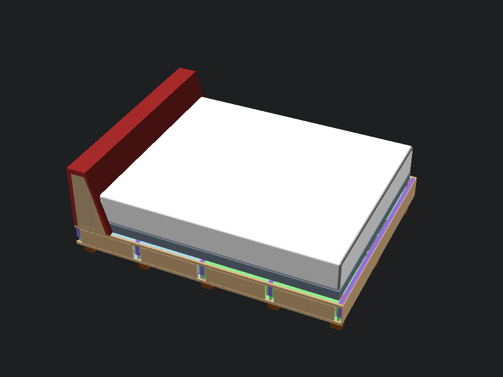

The current structural screen combines a 2,000-pound distributed chassis load with a 500-pound concentrated edge load. It reports 676 psi crossmember bending stress against a 1,000 psi screen, 0.0235-inch deflection against an L/360 limit of 0.0924 inch, and 276 psi local bulkhead compression against a 300 psi screen. These are calculation screens, not a certified furniture rating. The material coupons, complete connections, racking test, and controlled proof load remain part of the load path.

<strong>Adjustable-base compatibility:</strong> The Power-Flex 3 product page states an 850-pound capacity but does not say whether that figure applies to one half or the paired sleep surface, nor which loads it includes. A rough evenly shared occupant comparison is 375 pounds per half before mattress and bedding loads, but that is not a manufacturer rating. Confirm the delivered law labels, applicable manual, mattress weight, and written manufacturer interpretation before treating the complete sleep system as compatible.

## Hardware schedule

| Use | Working selection | Controlled installation requirement |
|---|---|---|
| Eight drawer pairs | [Accuride 3832E, 24 in](https://www.accuride.com/en-us/products/drawer-slides/3832e-light-duty-full-extension-slide-with-lever-disconnect) | 1.80 in high, 0.50 in side space per side, 100 lb rating at the tested width, side mount, lever disconnect. Build each drawer exactly 1.00 in narrower than its measured opening. |
| Two pod pairs | [Accuride 9308-E16](https://www.accuride.com/media/amasty/amfile/attach/63beb4dc6b2872c888fc3f51a8bcb234.pdf) | 16 in full travel, 3.00 in high, 0.75 in side space per side, lock-in/lock-out, non-disconnect, side mount. Use one left/right pair per pod and the manufacturer's wood fastener pattern. |
| Midpoint module seams | Eight 3/8-16 × approximately 2-1/2 in SAE J429 Grade 5 hex bolts | Use 7/16 in clearance holes, 1-1/4 in OD plated washers under both head and nut, and matching Grade 5 nylon-insert lock nuts. Final length must expose at least two threads without bottoming the unthreaded shank. |
| Seam alignment | Two 3/8 in steel dowel pins in replaceable hardwood blocks per module pair | Press fit on one side and slip fit on the mating side. The pins position the modules; the bolts clamp them. Prove the drilling jig on scrap. |
| Crossmember retention | Shop-made hardwood keeper-block system, not yet released | Prove a full-size seat mockup that restrains uplift and movement with removable through-bolts or machine screws into backed hardware, uses only broad faces, stays below the adapter plane, and remains accessible outside drawer and service envelopes. Do not use A21Z angles: their specified 1-1/2 in screws protrude through this plywood geometry. |
| Floor protection | Loose, dense, non-staining felt or hard-plastic pads covering nearly the full 3.5 in support footprint | The installed LVP manufacturer must approve the exact contact material. Do not use rubber or latex. Do not rely on peel-and-stick adhesive as the structural capture. |
| Adapter attachment | #10 pan-head wood screws into replaceable hardwood chassis cleats | Countersink or counterbore so no screw head contacts the Power-Flex. Adapter holes remain independent of base retention holes. |
| Power-Flex retention | Close-fitting removable wood blocking around verified stationary frame edges | The published platform-ready guidance confirms that the base may rest flat without legs; it does not publish permission to drill the frame. Treat drilling as prohibited unless Personal Comfort approves the exact location in writing. |

The old pod envelope was not buildable: a true heavy-duty locking slide does not fit a 2-inch-high × 3/8-inch-thick cavity. The 16-inch 9308E corrects the envelope to 3 inches high and 3/4-inch side space while locking at the desired 16-inch extension. The 24-inch version was rejected because its lock-out would not engage at a partial 16-inch extension.

## Release gates

| Gate | What may proceed | What remains blocked |
|---|---|---|
| Room gate | Material purchasing and coupons | Any full-size cut |
| Material gate | Support blocks and rough panel breakdown | Final dados, rabbets, notches, bolt holes |
| Coupon gate | Final chassis joinery | Hardware holes not represented by the selected hardware |
| Chassis gate | Drawers, finish panels, headboard modules | Power-Flex adapters and base retention |
| Delivery gate | Adapter templates and service routing | Any Power-Flex-specific cut before both halves are measured |
| Mockup gate | Pod cassettes | Final pod panels and slide holes |
| Proof gate | Sleep-system installation | Human use |

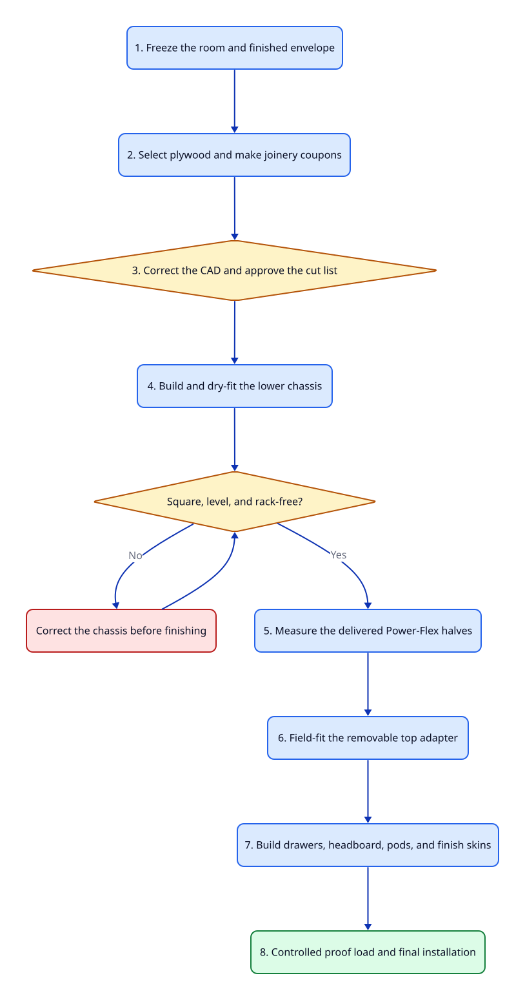

## Complete construction sequence

### Step 1. Verify the room and delivery route

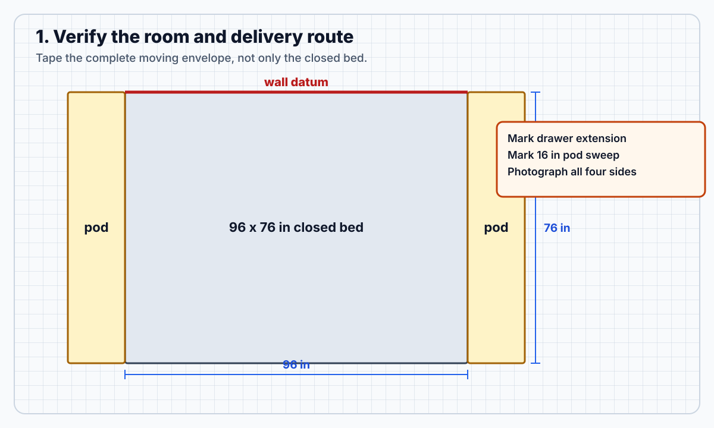

**Tools:** Tape measure, laser measure, 6-foot level, square, painter's tape, phone camera, rigid 47.875 × 27.25-inch carry template.

**Procedure**

- Choose one permanent wall corner as the datum and record every room measurement from it.
- Measure clear wall width, wall-to-foot length, both walkways, baseboard projection, outlet faceplate and plug projection, registers, doors, and nearby furniture.
- Record the wall construction and map verified studs or other structural framing across the full headboard width. Do not infer framing from outlet position alone.
- Record the room story, floor construction if known, and floor-joist direction and span from drawings or a non-destructive accessible location. A qualified structural reviewer must include the building floor in the load-path and proof-load review.
- Tape the 96 × 76-inch closed bed on the LVP. Extend the tape 16 inches beyond each side for the pods and 24 inches beyond each side for drawers.
- Mark the wall-side service zone and the provisional 4-inch mattress overlap. The delivered articulation test may force a larger wall gap or a longer bed.
- Carry the rigid module template from the shop to the bedroom. Rotate it through every doorway, hallway turn, stair, and ceiling pinch point.
- Photograph the footprint and all obstructions with a tape or ruler visible.

<strong>Stop if:</strong> Any open drawer or pod blocks required circulation, a module cannot reach the room, the outlet would be buried, or the 96-inch length lacks articulation and walkway clearance.

<strong>Pass when:</strong> One dated sketch records the datum, room, obstructions, verified wall framing, known floor framing, closed bed, open drawers, open pods, and delivery route.

### Step 2. Qualify the plywood and prove the joinery coupons

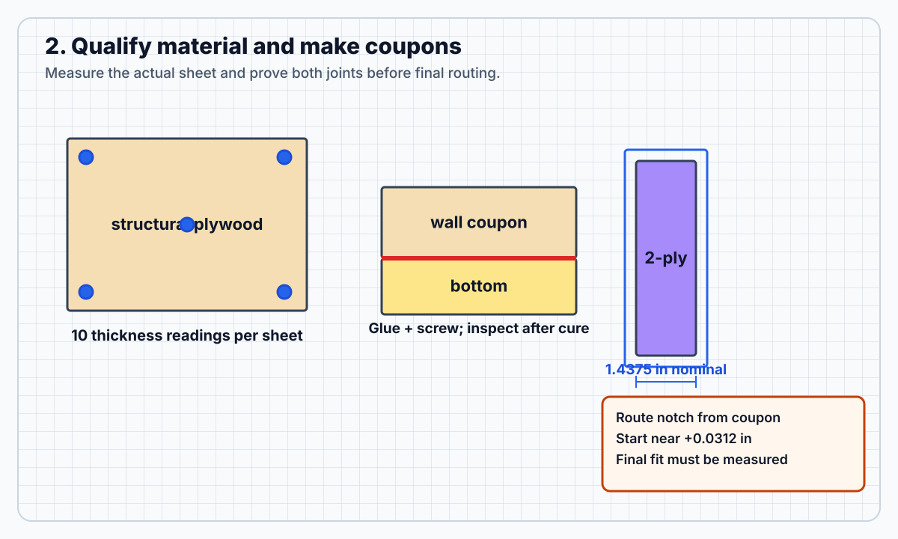

**Tools:** Calipers, 8-foot straightedge, track saw, table saw, plunge router, drill press, drill/driver, clamps, flat cauls.

**Procedure**

- Buy one candidate structural sheet before the full order. Use structurally rated veneer-core plywood; reject MDF core, particle core, visible delamination, large core voids, twist, or bow that cannot be clamped flat.
- Measure ten points across the candidate sheet. Record minimum, maximum, and typical thickness. Repeat this inspection on every purchased sheet and group similar sheets.
- Make a bottom-to-wall dado or rabbet coupon from the actual stock. Leave at least two intact outer plies beyond the dado floor.
- Glue and screw the coupon with the planned structural screw, pilot, and countersink. After cure, inspect for splitting, stripped threads, rocking, glue starvation, and face damage.
- Laminate a two-ply crossmember coupon between flat cauls. Measure width at both ends and center after cure.
- Route a matching seat from the production template. The member must enter by hand, come out without damage, and show no visible side play.
- Record the released dado width, depth, notch width, pilot drill, countersink, screw, glue, and clamp sequence on the shop drawing.

<strong>Stop if:</strong> Sheet thickness varies enough that one setup cannot produce repeatable joints, the laminate bows, the coupon needs hammering, or the joint can rack by hand.

<strong>Pass when:</strong> The cured coupon remains square, the crossmember seats repeatedly, and all measured-stock values replace nominal values in the final cut setup.

### Step 3. Fabricate the seventeen floor supports

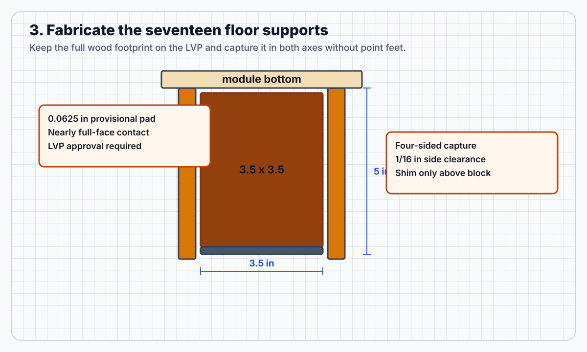

**Tools:** Miter saw, stop block, drill press, sander, calipers, long straightedge.

**Procedure**

- Select straight, dry 4×4 stock or laminate stable plywood blocks. Mill all seventeen pieces to the same 3.5 × 3.5-inch footprint.
- Select the exact LVP-approved pad material before cutting support height. Avoid rubber and latex; manufacturer care guides commonly call for non-staining felt or hard plastic, but the installed floor's documentation controls.
- Calculate each wood block as `5.000 in - actual pad thickness`. Do not reserve an uncontrolled loose shim in this stack.
- Cut all blocks with one stop-block setup. Mark station A through E and position L, C, or R.
- Cut four capture cleats per support: two control X and two control Y. Their inside spacing equals the measured block width plus 1/8 inch total clearance.
- Drill attachment holes in the cleats before installation. Cleats attach to the module underside and do not penetrate the floor pad.
- Dry-stack pad, block, and scrap module bottom on a flat reference. Compare all seventeen heights and sand only high pieces.

<strong>Stop if:</strong> A pad exposes adhesive or rubber to the LVP, any block rocks, or total heights differ by more than the leveling tolerance established from the room survey.

<strong>Pass when:</strong> Every labeled stack equals 5.000 inches within the approved tolerance and retains the full 3.5-inch floor footprint.

### Step 4. Break down and label the structural panels

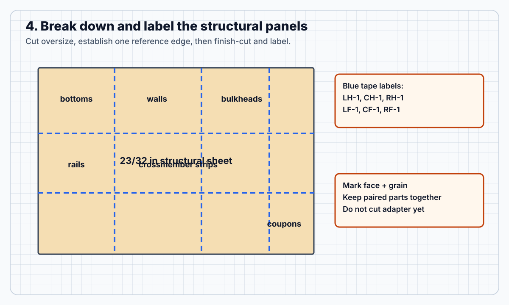

**Tools:** Track saw and sacrificial foam, table saw, outfeed support, straightedge, square, blue tape, pencil.

**Procedure**

- Generate the released cut list from the measured structural thickness. Group bottoms, full-height walls, lower bulkheads, shallow outer rails, full-depth slide-carrier webs, crossmember laminations, capture cleats, and coupons.
- Mark every sheet's reference face, reference edge, veneer direction, and measured thickness group before cutting.
- Rough-cut oversized panels with the track saw. Establish one straight reference edge, then finish-cut parallel width on the table saw or with a second verified track-saw setup.
- Label parts LH, CH, RH, LF, CF, and RF for left/center/right and head/foot. Add the part function and reference arrow.
- Keep paired walls and bulkheads stacked in module sets so mirrored parts cannot be mixed.
- Cut crossmember strips long and leave their ends unfinished until the assembled chassis supplies the actual width.
- Do not cut the two adapter blanks yet; their final lattice depends on delivered-base measurements.

<strong>Stop if:</strong> A cut loses its reference edge, labels become ambiguous, a panel is out of square, or a visible defect falls at a dado, bolt, or high-bearing location.

<strong>Pass when:</strong> Every structural panel is square, labeled on a hidden face, grouped by module, and traceable to one cut-list row.

### Step 5. Route dados, rabbets, and crossmember seats

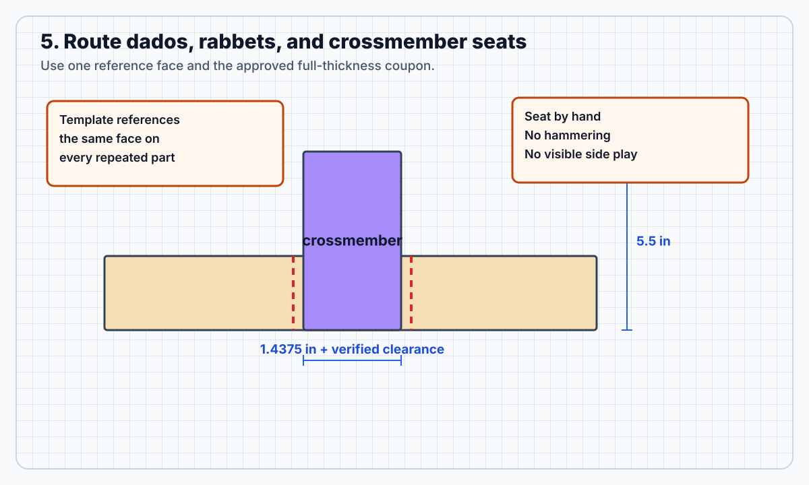

**Tools:** Plunge router, pattern bit or guide bushing, production templates, edge guide, drill press, backer boards.

**Procedure**

- Clamp each production template from the labeled reference edge and face. Never flip a setup to "make it mirror" without a mirrored template.
- Route bottom-to-wall dados or rabbets in shallow passes. Use backers at exits and climb-cut only the small breakout-prone corner when the router setup safely controls it.
- Route five station seats in each applicable longitudinal wall and outer rail. The head station preserves the 12-inch center service opening.
- Test every routed seat with the numbered crossmember coupon, not a nominal spacer.
- Drill the eight midpoint bolt holes through paired scrap first, then use a hardened drill guide or clamped paired bulkheads so axes stay perpendicular.
- Leave alignment-pin holes undersize until Step 9, when the assembled module pairs can be match-drilled.
- Seal exposed internal plies only after glue surfaces and reference marks are protected.

<strong>Stop if:</strong> A template slips, a seat breaks through an outer ply, a member rocks in its seat, or repeated parts differ enough that one crossmember cannot fit all stations.

<strong>Pass when:</strong> Each unique joint matches its coupon, all repeated seats share one setup, and a marked dry-fit proves the service opening remains clear.

### Step 6. Assemble the two center modules

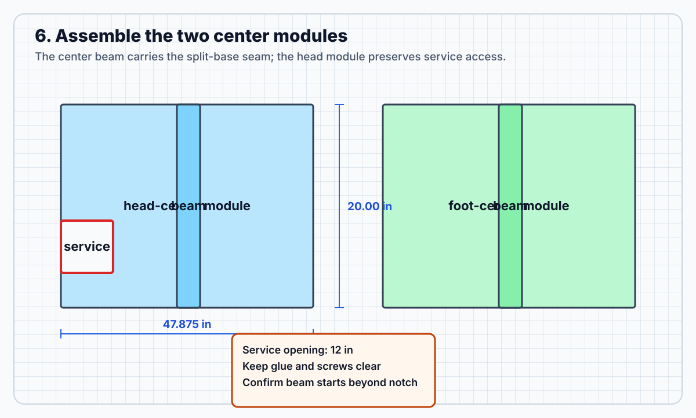

**Tools:** Flat assembly table, long clamps, squares, drill/driver, glue roller, winding sticks.

**Procedure**

- Dry-assemble the head-center module first. Confirm its wall-side bottom notch and center-beam start preserve the full service route.
- Apply an even glue film to the approved joints. Seat both longitudinal walls, lower bulkheads, and doubled center beam against their reference faces.
- Use the coupon-approved screws only as clamps and reinforcement; do not pull an open joint closed with screw torque.
- Measure both diagonals before the glue skins, after initial clamping, and again before cure.
- Remove squeeze-out from crossmember seats, seam faces, and service openings.
- Repeat for the foot-center module using the same sequence but without the wall-side service notch.
- After cure, place each module on a flat surface and check twist with winding sticks. Dry-seat the crossmember coupon at all stations.

<strong>Stop if:</strong> The center beam is not straight, the service opening narrows, either module rocks, or diagonal error grows after clamps are released.

<strong>Pass when:</strong> Both center modules are flat, square, equal in width, and the center beams align when their midpoint faces touch.

### Step 7. Build one master side module, then copy it

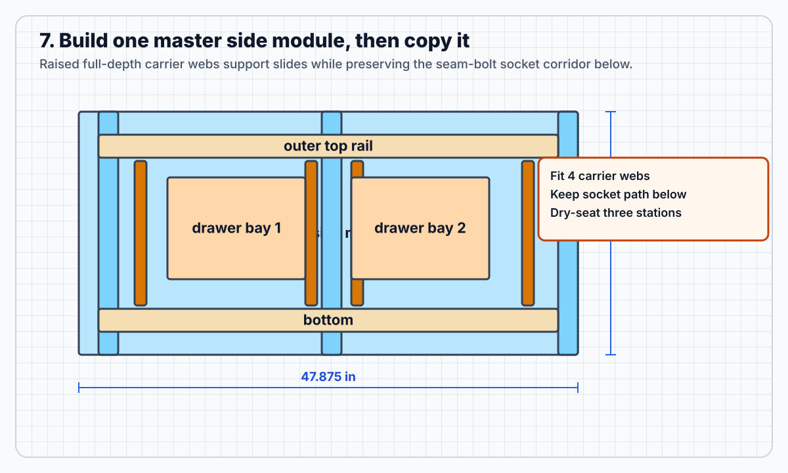

**Tools:** Same assembly setup as Step 6, plus drawer-opening story stick.

**Procedure**

- Dry-assemble one head-side module as the master. Keep the full-height inner wall toward the bed center and the shallow outer rail toward the room.
- Verify both drawer openings with one story stick that records width, height, slide centerline, and front reveal.
- Dry-seat the crossmember coupon at the head, drawer-divider, and midpoint stations.
- Fit the four full-depth slide-carrier webs at the drawer-bay boundaries with their lower edges at the 7.5-inch crossmember-bottom plane and their upper edges against the shallow outer rail. House and reinforce both ends with the released broad-face cleat or dado detail; do not rely on screws driven into plywood edges.
- Confirm a 1-inch-diameter socket envelope centered on every midpoint seam bolt passes below the raised carrier webs. The current model preserves 0.391 inch of vertical clearance.
- Glue, clamp, square, and screw using the approved coupon sequence.
- After cure, measure module length, width, both diagonals, drawer openings at front and back, and top-rail straightness.
- Use the accepted master as the comparison fixture for the opposite head-side module and both foot-side modules. Do not copy a measurement from memory.
- Keep left/right labels visible until final finish panels are installed.

<strong>Stop if:</strong> The story stick fits one end but not the other, a carrier lacks a released attachment detail, a socket envelope touches a carrier, the outer rail bows, a drawer opening is a parallelogram, or the crossmember coupon binds.

<strong>Pass when:</strong> All four side modules match the accepted master and every drawer opening preserves the selected slide's 1/2-inch clearance per side.

### Step 8. Lay out the support grid and set the six modules

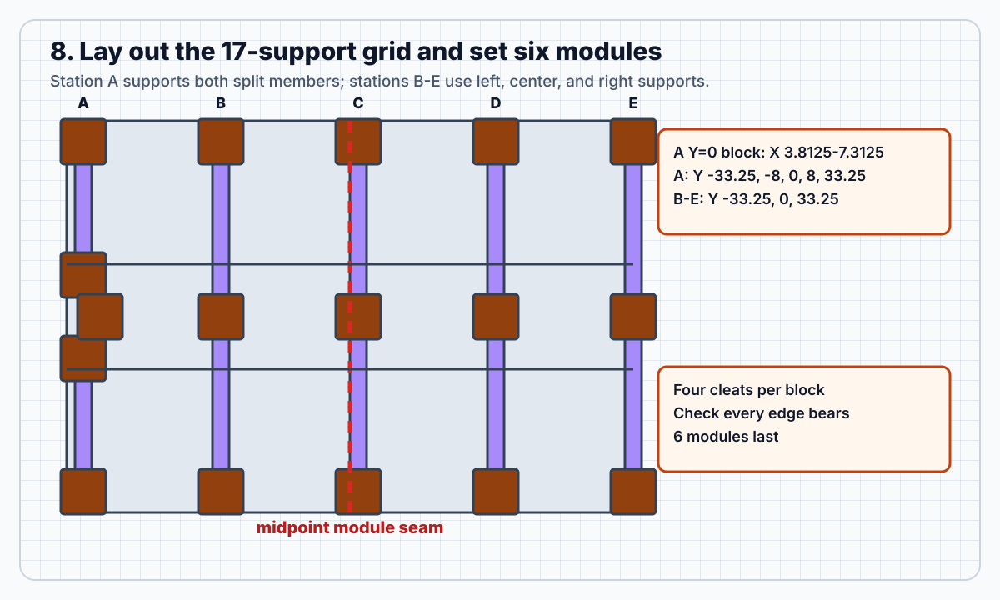

**Tools:** Painter's tape, chalk line, laser, long level, hardboard moving paths, two-person lifting equipment appropriate to module weight.

**Procedure**

- Protect the route and LVP with clean hardboard sheets. Lift modules; never drag pads or supports across the floor.
- Transfer the five station centerlines from the room datum. At station A mark support centers at Y = -33.25, -8, 0, +8, and +33.25 inches. The Y=0 center-beam block is the exception: its footprint runs X = 3.8125–7.3125 inches from the wall datum so its head-side capture cleat starts beyond the 3-inch service notch. At stations B–E mark Y = -33.25, 0, and +33.25 inches.
- Place the seventeen loose approved pads, then their matching labeled blocks. Keep the pad edges fully under the blocks.
- Install capture cleats on the module undersides using the dry support blocks as spacing gauges.
- Set the three head modules first, then the three foot modules. Lower each module over its captured supports without folding a pad.
- Bring column seams together by hand. Do not install bolts or crossmembers yet.
- Check that each block bears fully by trying a thin paper feeler at all four edges. Correct only with a captured shim above the support.

<strong>Stop if:</strong> A block bridges an LVP joint or floor defect, any pad folds, a module rocks, or closing a seam lifts another support.

<strong>Pass when:</strong> All six modules sit freely on all seventeen supports with midpoint faces touching, every block is captured in both axes, and no fastener force holds the chassis down.

### Step 9. Align and bolt the midpoint seams

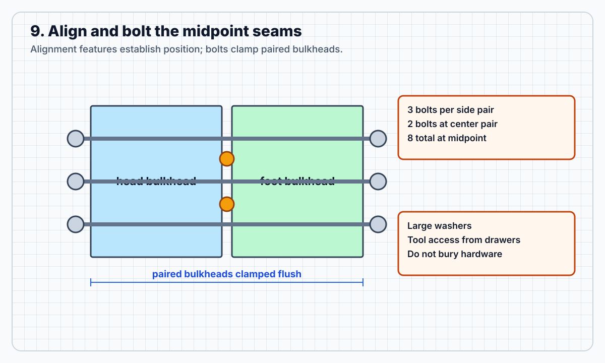

**Tools:** Clamps, drill guide, 7/16-inch bit, alignment-pin reamer, 9/16-inch sockets and wrenches, torque-mark paint.

**Procedure**

- Clamp one module pair with top, bottom, and side faces flush. Verify the pair remains square before drilling.
- Match-drill two alignment locations through replaceable hardwood blocks attached near the top and bottom of the seam. Press each steel pin into one side and ream the mating side for a hand slip fit.
- Reassemble on the pins and confirm the seam closes without bolt force.
- Install three through-bolts in each side-module pair and two in the center pair outside the service opening.
- Place 1-1/4-inch OD washers under every head and nut. The modeled 1.78125-inch bulkhead leaves 0.266 inch from washer edge to each panel edge. Tighten nylon-insert nuts only until the washers seat and the seam closes; do not crush the plywood.
- Mark each nut and washer with a witness line.
- Remove and reinstall one pair to prove the pins, washers, and tools work in the intended bedroom access.

<strong>Stop if:</strong> A washer visibly dishes the plywood, the pin must be hammered, tightening changes chassis square, or a socket cannot reach after a drawer is installed.

<strong>Pass when:</strong> Pins alone align each pair, bolts close the seam without distortion, and all eight fasteners remain removable from planned service openings.

### Step 10. Laminate, fit, label, and retain the crossmembers

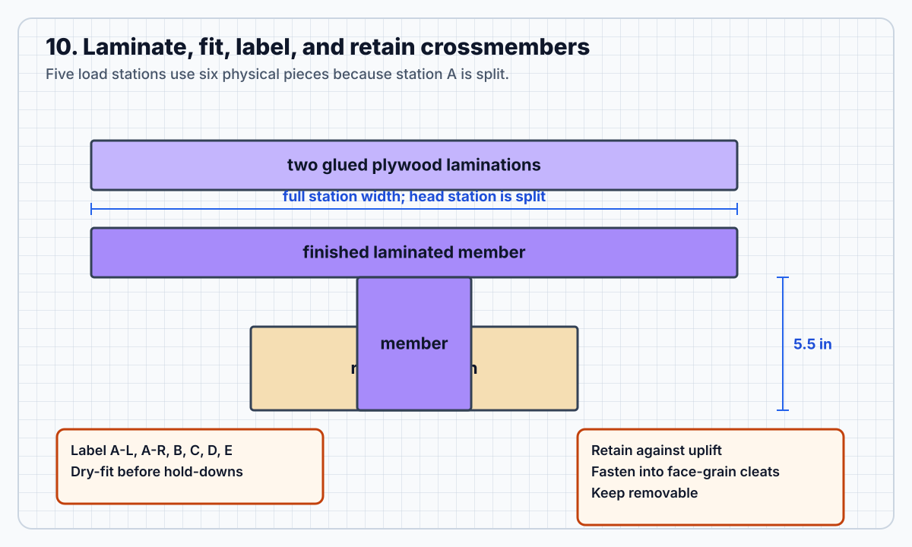

**Tools:** Flat cauls, glue roller, clamps, track saw, router plane or shoulder plane, hardwood keeper stock, drill guide, candidate 1/4-inch machine or through-bolt hardware.

**Procedure**

- Laminate enough straight two-ply stock for A-L, A-R, B, C, D, and E. Alternate cosmetic faces only if doing so does not reverse a structural face specified by the plywood manufacturer.
- Clamp against flat cauls from center outward. Remove squeeze-out before it hardens on bearing edges.
- After cure, joint one edge and cut the opposite edge to the coupon-approved width. Cut each physical member to its measured station span.
- Ease only the insertion edges with two light hand passes; do not round bearing faces.
- Drop each member into its labeled station by hand. At station A, confirm A-L bears on the -33.25 and -8 supports and A-R bears on +8 and +33.25; the separate Y=0 support carries the center beam. Confirm stations B–E each bear on left, center, and right supports.
- Build a full-size crossmember-seat mockup for the removable hardwood keeper system. The keeper must restrain uplift and movement, attach through broad faces with through-bolts or machine screws into properly backed hardware, remain below the adapter plane, and avoid drawers, seam-bolt tools, and service routes.
- Have the keeper geometry and fastener schedule released with the connection review before drilling production parts. Do not install A21Z angles or shorten their specified screws: the 1-1/2-inch SD9112 screw would protrude through the 23/32-inch module plywood and the 1.4375-inch crossmember.
- Remove and reinstall every crossmember once; no finish part may be required to access a retainer.

<strong>Stop if:</strong> Any member bridges above a bulkhead, rocks in a seat, requires impact, bows the chassis, or forces a keeper into plywood edge grain or a drawer envelope.

<strong>Pass when:</strong> Six labeled pieces seat fully, both split station-A pieces bear on two supports, stations B–E bear on three supports, and every released keeper can be inspected and removed.

### Step 11. Square, level, and rack-test the lower chassis

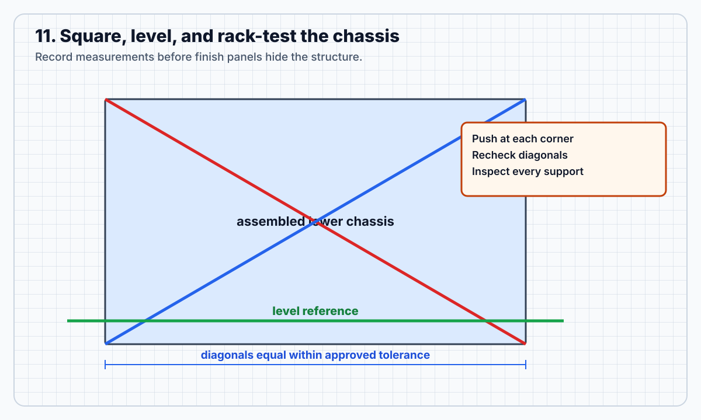

**Tools:** Two long tape measures, laser or water level, 6-foot level, feeler gauges, removable test brace, notebook.

**Procedure**

- Measure both full chassis diagonals and each module-column diagonal. Record the numbers rather than writing only "square."
- Record elevation at all seventeen support centers and along both outer rails and the center seam.
- Correct small floor variation with hard, captured shims above a support block. Never stack soft pads or place a point shim against the LVP.
- Push and pull each corner laterally with the same controlled hand force. Re-measure diagonals and inspect seams, retainers, and supports.
- Apply the same test at headboard attachment locations and the center service opening.
- Remove one crossmember and one module pair, then reassemble to prove the intended modular sequence does not depend on accidental friction.
- Photograph every fastener and support before they are covered.

<strong>Stop if:</strong> A support unloads, a seam moves, a witness mark shifts, a retainer deforms, the chassis does not return to its original diagonals, or a captured shim can escape.

<strong>Pass when:</strong> Recorded square and level measurements repeat after racking and one disassembly cycle, with all supports still bearing.

### Step 12. Measure each delivered Power-Flex half

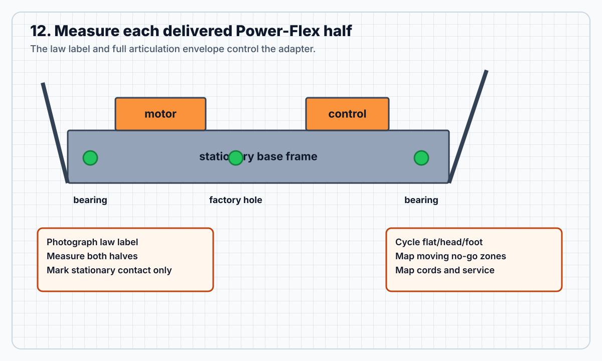

**Tools:** Large cardboard sheets, tape, calipers, straightedge, camera, removable dot labels, second person.

**Procedure**

- Photograph each law label and identify the exact applicable Personal Comfort or OEM manual before moving the base.
- Measure each half independently: overall length, width, no-leg height, frame perimeter, center seam, retainer bar, motors, control boxes, USB ports, lights, cords, and any factory holes or threaded sockets.
- Set one half upside down only as its manual permits and without loading moving links. Trace the stationary frame on cardboard.
- Mark every stationary bearing surface green, every moving component and service zone red, and every cable or hose route blue.
- Return the half upright on temporary full support away from the wall. Cycle flat, full head, full foot, combined positions, massage, and return-to-flat.
- Measure wallward, footward, upward, downward, and lateral excursions at each state. Repeat for the other half; do not assume they are identical.
- Ask Personal Comfort in writing whether any observed factory holes may be used for retention. The public platform-ready guidance confirms flat support without legs but does not authorize new drilling.

<strong>Stop if:</strong> The manual is unknown, a component crosses a proposed bearing line, the 4-inch overlap binds articulation, or the two halves differ from the planning envelopes.

<strong>Pass when:</strong> Two dated underside maps and one articulation table identify stationary bearing, moving no-go, service, wall-clearance, and manufacturer-approved retention zones.

### Step 13. Transfer the base maps to removable adapter lattices

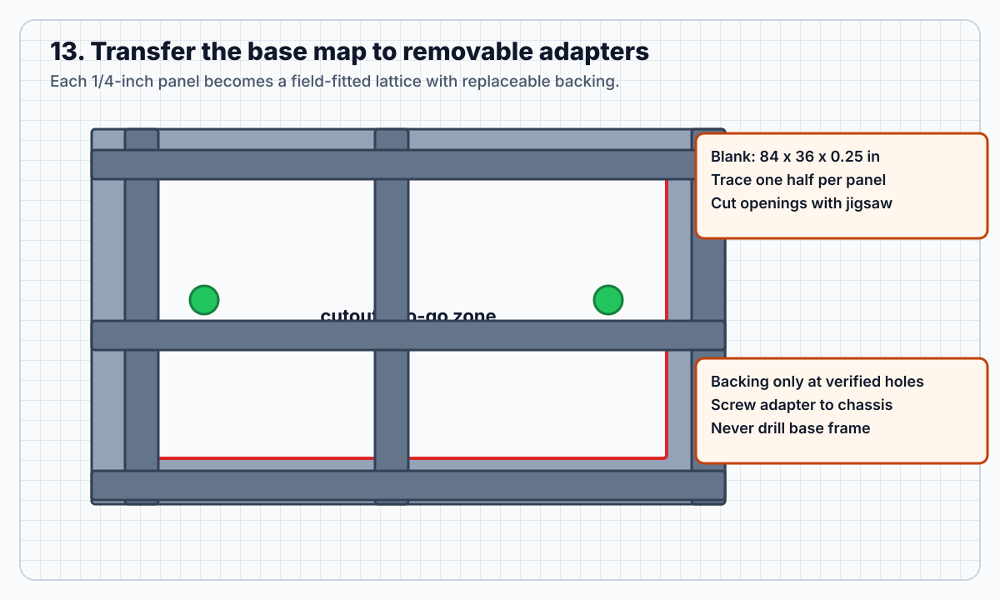

**Tools:** Two 1/4-inch plywood blanks, cardboard maps, jigsaw, router and template, drill press, hardwood blocking, pan-head screws.

**Procedure**

- Cut each blank to the delivered half's measured footprint, not automatically to 84 × 36 inches.
- Transfer the green bearing lines, red no-go openings, blue service routes, center orientation, and head/foot direction from its cardboard map.
- Preserve continuous material beneath the stationary perimeter and every verified interior bearing line. Connect these rails with enough cross ties that the lattice stays flat when removed; the 1/4-inch material is a template and locator, not a structural bridge.
- Cut motor, linkage, control-box, light, USB, cord, and hand-access openings with rounded inside corners.
- Add replaceable hardwood backing only beneath manufacturer-approved retention points or removable perimeter blocks.
- Place each lattice on the chassis and confirm every base-bearing rail has continuous structure immediately beneath it. Use the modeled outer longitudinal rails and add removable between-crossmember blocking wherever the delivered bearing map requires another longitudinal line. Never leave a bearing line on an unsupported 1/4-inch lattice span.
- Fasten the lattice to replaceable chassis cleats with flush #10 pan-head screws. No screw may protrude into the base.
- Set the base half on the lattice and cycle every position while observing from all accessible sides. Use gravity and close-fitting removable wood blocks unless written guidance authorizes a factory attachment.

<strong>Stop if:</strong> A lattice rail bridges an unsupported gap, touches moving hardware, blocks cooling or service, rocks, or requires a new hole in the Power-Flex frame.

<strong>Pass when:</strong> Both halves lie flat, stay located through full articulation, lift off without altering the chassis, and leave every power and service component accessible.

### Step 14. Build the drawers and install slides

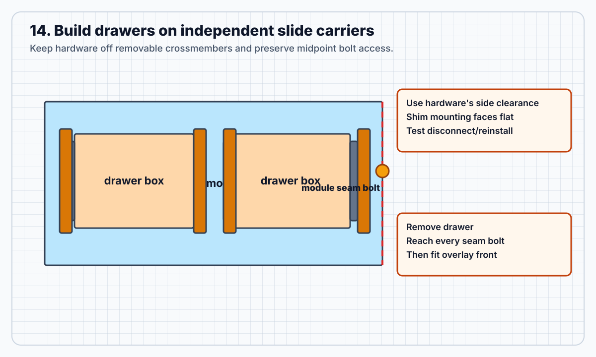

**Tools:** Accuride 3832E slides, slide jig, story stick, table saw, router, clamps, drill/driver.

**Procedure**

- Measure each finished opening at front and back after the chassis is bolted and square.
- Set drawer outside width to the smaller opening width minus exactly 1.00 inch for the two 0.50-inch slide spaces. The model guarantees at least a 19.34 × 24 × 5.28-inch envelope in every bay; use each bay's smaller measured opening rather than assuming all eight widths are identical.
- Use 24-inch box depth only where the measured opening and slide specification permit full seating without touching crossmembers or wiring.
- Build one square test box with captured bottom joinery. Confirm both diagonals before building the remaining seven.
- Mount cabinet slide members to the independent fixed carrier webs from one story-stick centerline. The carriers remain part of each module and do not depend on removable crossmembers. Shim broad mounting faces flat; do not bend a slide to follow plywood variation.
- Install drawer members with the manufacturer's allowed pan- or truss-head screws. Cycle empty, then with a representative distributed drawer load below the slide rating.
- Operate both disconnect levers and remove the drawer. Confirm direct tool access to every seam bolt, crossmember retainer, and service connection behind it.
- Build the other seven boxes only after the test drawer repeats smoothly in every opening.

<strong>Stop if:</strong> A slide is forced into a narrow opening, the box racks, a screw rubs a moving member, the drawer cannot disconnect, or installed hardware blocks structural service.

<strong>Pass when:</strong> Eight unloaded and representative-load drawers open fully, remain aligned, disconnect without damage, and preserve structural access.

### Step 15. Build and attach the three headboard modules

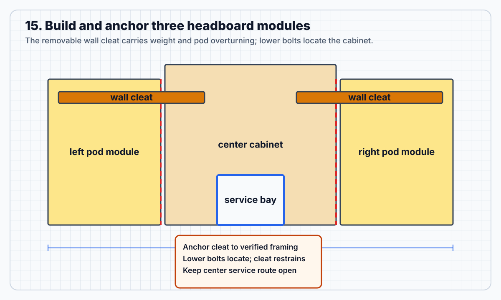

**Tools:** Furniture-grade birch plywood, full-size side-profile template, track saw, router, clamps, drill guide, stud/framing locator verified by inspection, temporary carry handles.

**Procedure**

- Make one full-size headboard side template from inexpensive sheet stock. Check the 14-inch bottom depth, 7-inch top depth, 36-inch height, mattress recess, pod opening, wall clearance, and service access against the integrated model and room.
- Divide the finished 76-inch width into a 17.625-inch left pod module, 40.75-inch center cabinet, and 17.625-inch right pod module. Adjust only if the full-size pod mockup or delivered room measurement requires it.
- Build each pod module with a dedicated 3/4-inch structural floor beneath its fixed slide rail. Build all three modules as torsion-resistant plywood cabinets with bed-facing skins, wall-side service openings, and reinforced lower locating points shown on the released drawing.
- Preserve the 12-inch center service drop and enough removable wall-side back opening to reach both base supplies, pump hoses, and pod hardware.
- Carry each empty module through the route before applying finish.
- Have a qualified reviewer specify the two-part structural wall cleat and anchor schedule from the verified wall construction and framing map. Keep the 12-inch center service route open. The cleat is the primary gravity and pod-overturning load path.
- Install the removable cleat into the verified framing, then hang and clamp the three modules on the square chassis. Align their front slope and top edge and install removable seam bolts or connector hardware into reinforced broad-face blocks.
- Through-bolt the lower headboard locating cleats to reinforced head-module bulkheads with hardware accessible from drawer or service openings. These lower bolts locate the cabinet; do not count them as the primary gravity or anti-tip restraint and do not rely on screws into plywood edges.
- Verify the headboard does not become the wall stop; the measured articulation clearance controls the final wall gap.

<strong>Stop if:</strong> Wall construction or framing is unverified, cleat anchors lack a released schedule, a module cannot be carried, the front slope steps at a seam, attachment requires edge-grain screws, the service route narrows, or the headboard touches the wall before the chassis reaches its approved position.

<strong>Pass when:</strong> Three modules install and remove independently, align as one full-width headboard, bear on the released wall cleat, and remain rigid under controlled hand racking without loading only the lower locating bolts or hiding service hardware.

### Step 16. Build and test each pull-out pod cassette

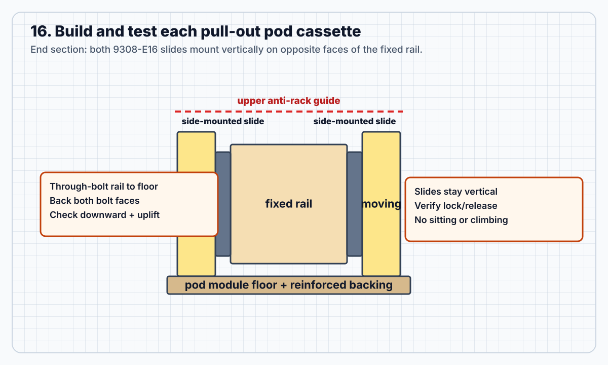

**Tools:** One left/right Accuride 9308-E16 pair per pod, full-size plywood mockup, manufacturer hole template, upper guide material, travel stops.

**Procedure**

- Build a full-size unfinished mockup before cutting birch. Provide 0.75-inch side space per slide, 3-inch mounting height, and access to every non-disconnect mounting screw.
- Through-bolt the fixed rail to the dedicated pod-module floor with reinforced backing on both bolt faces. Stagger hardware as required by the accepted mockup and preserve tool access.
- Mount the two slides in normal side-mount orientation on opposite vertical faces of the fixed rail, separated front-to-back across the pod shelf. Do not flat-mount them.
- Use the manufacturer's wood fastener pattern and screw geometry. Reinforce mounting faces with hardwood or doubled plywood so screws do not rely on one veneer.
- Extend the cassette through its full 16-inch travel and confirm both locks engage together. The lever must be reachable without putting fingers near a pinch point.
- Add a low-friction upper guide near the top of the pod to resist front/back racking without carrying the primary vertical load.
- Add positive hard stops that protect the slide locks from impact and keep the closed cap flush.
- Load the shelf with dead weight representing CPAP equipment and chargers, then apply the reviewer-released downward and uplift reactions plus controlled front/back corner loads. Inspect the fixed rail, floor, backing, fasteners, wall cleat, and module seams. Do not use a person as test weight.
- Verify CPAP hose, power, and charging cords can move through full travel without crossing slide members or lock levers.
- Transfer the accepted mockup dimensions and hole pattern to birch only after repeated open/close cycles.

<strong>Use limit:</strong> The pod is an equipment shelf, not a seat, step, handrail, or climbing surface. The slide's catalog rating does not rate the plywood cassette, mounting screws, headboard, or overturning moment.

<strong>Stop if:</strong> Locks engage at different times, the shelf twists, the fixed rail or module floor lifts, a mounting face flexes, an upper guide binds, a cord enters a pinch zone, or fastener access requires destroying the pod.

<strong>Pass when:</strong> Each pod locks closed and fully open, runs without rack or cable contact, supports the approved equipment mockup, and remains removable by unscrewing accessible fasteners.

### Step 17. Fit birch skins, drawer fronts, fascia, edges, and finish

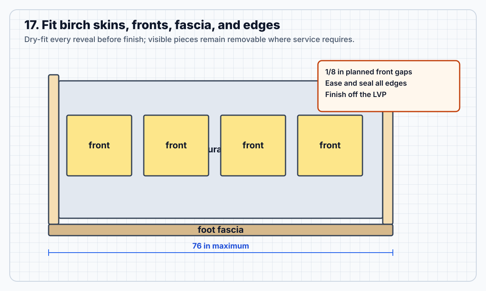

**Tools:** Furniture-grade birch plywood, hardwood edging, router table, sander, finish samples, reveal spacers.

**Procedure**

- Dry-fit the two 3/4-inch side finish planes and 1/4-inch foot fascia inside the 96 × 76-inch finished envelope.
- Fit upper and lower side rails first. Keep structural bolts, crossmember retainers, adapter screws, and drawer-slide screws reachable after drawers are removed.
- Edge-band or apply hardwood edging to every exposed plywood edge. Ease touch edges consistently and preserve square reference edges at reveals.
- Fit drawer fronts with 1/8-inch planned gaps. Use temporary tape or low-risk clamps before drilling handle and attachment holes.
- Open adjacent drawers together and confirm fronts, handles, pods, and mattress reveal do not collide.
- Remove all visible parts for sanding and finishing away from the LVP and sleep-system components.
- Apply the chosen finish to samples from the exact birch and edging first. Confirm color, sheen, repairability, and cure behavior.
- Seal hidden end grain and underside edges likely to see cleaning moisture. Keep glue surfaces and grounding points bare as required.
- Allow the finish to cure fully before bringing parts into the bedroom; "dry to touch" is not enough.

<strong>Stop if:</strong> A finish piece pushes the bed outside 96 × 76 inches, traps hardware, changes a drawer opening, blocks ventilation, or causes adjacent moving parts to touch.

<strong>Pass when:</strong> Reveals repeat, all moving parts clear, the finish is cured, and every service panel or drawer front can be removed in the documented order.

### Step 18. Route power, pump hoses, and moving slack

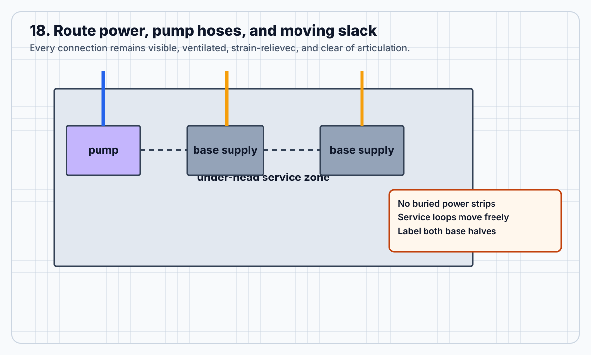

**Tools:** Manufacturer power supplies, surge protection approved for the equipment, removable cable clamps, braided sleeves, labels.

**Procedure**

- Place both Power-Flex power supplies, the Rego pump, and surge protection in ventilated locations reachable without moving the bed. The current product page says paired bases synchronize without a cable; follow the delivered manual if the supplied model differs.
- Do not permanently bury a power strip, transformer, battery box, plug connection, or reset device inside furniture.
- Route each adjustable-base cord independently and label left/right at both ends.
- Route both air hoses with broad bends through the center service drop. Prevent compression by the mattress, adapter, headboard seam, or drawer.
- Form service loops at every moving base connection using the measured articulation paths. Secure only the stationary side of each loop.
- Keep low-voltage charging, CPAP, and control cables clear of slide bearings, pod locks, crossmember brackets, massage motors, and pinch points.
- Cycle both base halves and both pods while one person watches every route. Repeat with drawers open and closed.
- Photograph the final route and add a simple service map to the printed guide.

<strong>Stop if:</strong> A cable becomes taut, a hose kinks, a connector moves, a power device lacks ventilation, a plug is inaccessible, or any route crosses moving metal.

<strong>Pass when:</strong> Every device can be unplugged and replaced, every moving state preserves slack, and no connection depends on an extension hidden inside the bed.

### Step 19. Proof-load the empty chassis

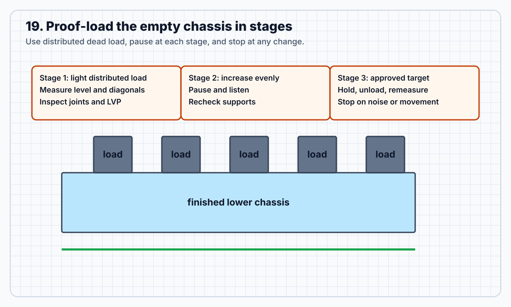

**Tools:** Known dead weights, broad load-spreading panels, remote camera if available, measurement log, exclusion barriers.

**Procedure**

- Remove the mattress, Power-Flex halves, drawers, pods, and loose electronics. Proof the furniture chassis and adapters as an empty structure first.
- Have the final target and distribution reviewed by a qualified structural professional before loading. The review must cover the furniture, connections, wall-cleat load path, LVP contact, and building floor structure including joist direction and span. The 2,000-pound CAD case is a design screen, not automatic permission to place 2,000 pounds in a bedroom.
- Establish an exclusion zone. Never use adults, children, or pets as proof weight and never work beneath a loaded chassis.
- Apply approved dead load evenly through broad panels at 25 percent of the released target. Pause, listen, and inspect every support, seam, washer, retainer, adapter, and floor contact.
- Record chassis diagonals, elevations, seam gaps, washer witness marks, and floor condition before advancing.
- Repeat the inspection at 50, 75, and 100 percent only if the previous stage is unchanged.
- Hold the released target for the approved interval, unload completely, and repeat all measurements after recovery.
- Inspect the LVP for indentation, staining, pad movement, or joint distress.

<strong>Stop immediately if:</strong> Any crack, pop, new creak, visible deflection, support unloading, pad movement, finish crack, seam gap, fastener shift, floor damage, or measurement change exceeds the reviewer's limit.

<strong>Pass when:</strong> The approved target is applied and removed without permanent dimensional change, connection movement, support movement, or LVP damage, and the reviewer accepts the recorded evidence.

### Step 20. Install the sleep system and complete final inspection

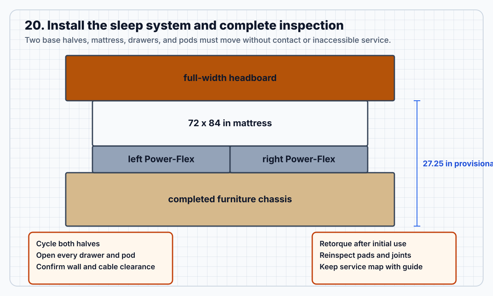

**Tools:** Two or more capable installers, clean lifting straps, final inspection log.

**Procedure**

- Install both field-fitted adapter lattices and verify their orientation labels and flush fasteners.
- Lift each Power-Flex half into place without dragging it across the adapter or pinching cables. Install only approved retention blocks or factory hardware.
- Reconnect power and controls, then cycle both halves empty through every position independently and in the paired mode described by the delivered manual.
- Install the mattress with both air hoses protected. Confirm its 72 × 84-inch envelope, 2-inch side and foot reveals, and provisional 27.25-inch top height.
- Cycle the bases again while observing the mattress, headboard overlap, hoses, wall gap, adapter, and center seam.
- Install drawers, pod cassettes, finish panels, and equipment. Open every moving combination that could reasonably occur together.
- Confirm emergency power-down access, surge protection, pump access, both power supplies, pod lock releases, drawer disconnects, structural bolts, and adapter screws.
- Record final diagonals, elevations, wall gap, bolt witness marks, and equipment route.
- Reinspect after the initial settling period and periodically thereafter. Any shifted witness mark, new sound, floor change, or movement returns the bed to the applicable earlier stop gate.

<strong>Stop before use if:</strong> The manufacturer has not clarified how the published capacity applies to the delivered halves and complete load, either half moves on its adapter, articulation contacts the headboard or wall, service loops tighten, or any proof-load observation returns.

<strong>Complete when:</strong> The finished bed remains inside the approved room envelope; both bases, eight drawers, and two pods move without contact; all equipment is serviceable; and the complete inspection record is stored with this guide.

## Source references

- [Personal Comfort Power-Flex 3 product page](https://personalcomfortbed.com/products/power-flex-3)
- [Personal Comfort platform-ready definition](https://hs.personalcomfortbed.com/knowledge-base/what-does-22zero-clearance22-or-22platform-ready22-mean)
- [Accuride 3832E product page and technical resources](https://www.accuride.com/en-us/products/drawer-slides/3832e-light-duty-full-extension-slide-with-lever-disconnect)
- [Accuride 9308E technical sheet](https://www.accuride.com/media/amasty/amfile/attach/63beb4dc6b2872c888fc3f51a8bcb234.pdf)
- [Shaw vinyl floor care](https://shawfloors.com/en-us/care-and-warranties/vinyl)
- [Mannington ADURA care and maintenance](https://www.mannington.com/residential/adura-luxury-vinyl/care-and-maintenance)
