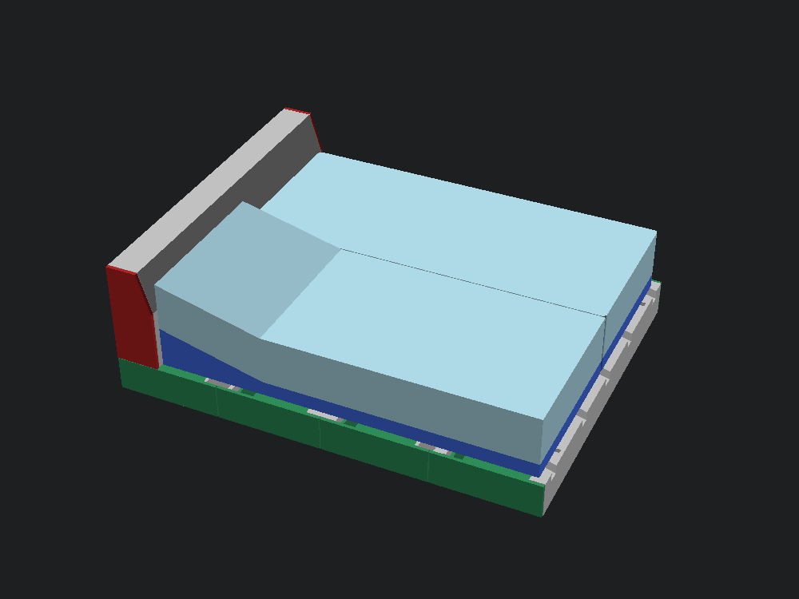
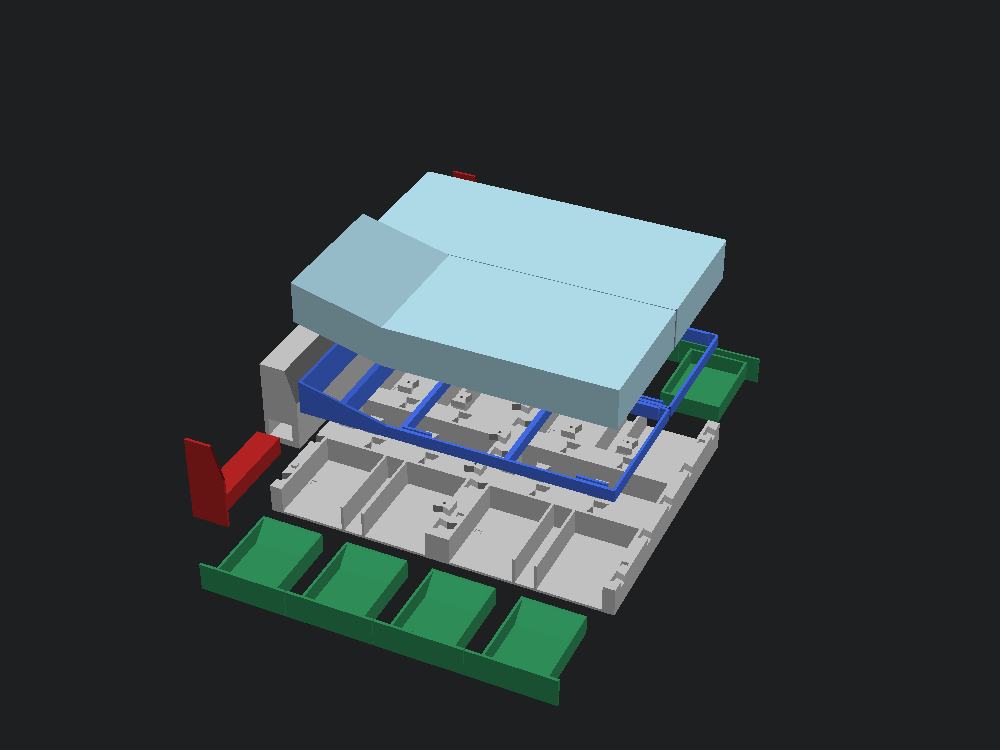
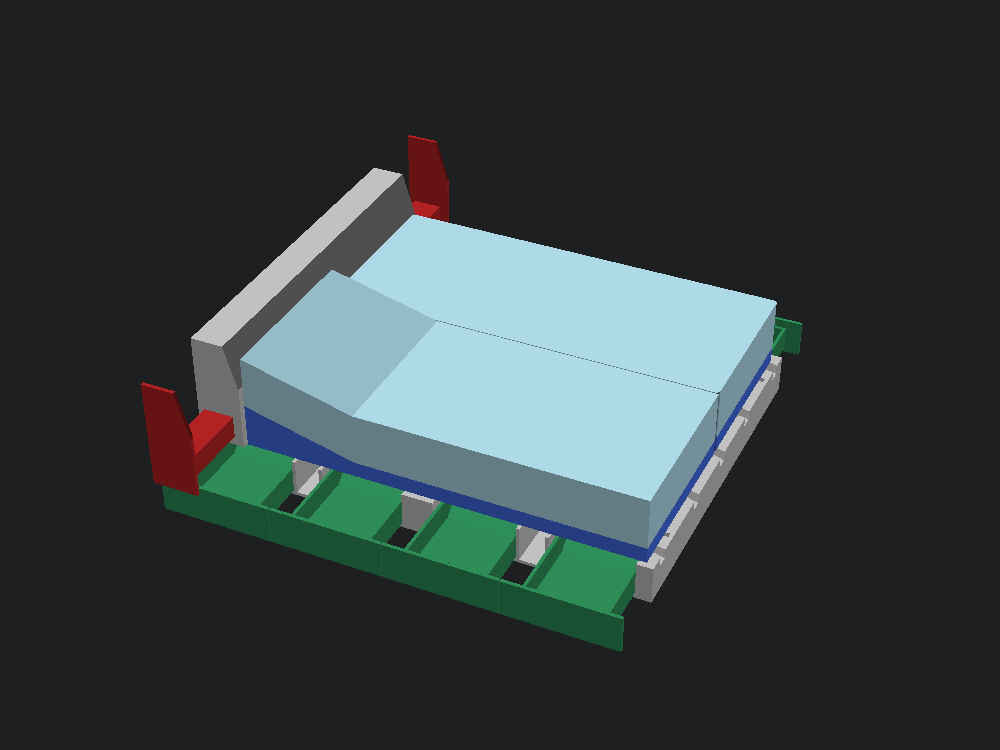

# Modular California king miniature

A 1:10, hand-assembled interpretation of the full-size storage bed. The construction model in the parent directory remains unchanged. This kit prioritizes removable modules, usable drawers, and lateral nightstand movement over reproducing miniature plywood hardware.



## Start here

The finished miniature is **243.2 mm long, 193.0 mm wide, and 91.4 mm high** with the nightstands closed. There are 48 production pieces, made from 13 distinct part files, plus three calibration pieces. One mattress is flat and the other has a fixed raised-head pose. Print one copy of a file per job and repeat it according to the quantity table. Do not slice an assembly STEP or the colored scene meshes.

The ready-oriented meshes and exact solids are in `build/parts/`. Corresponding single-part printer files are in `build/gcode/`. `build/manifest.json` is the quantity/orientation list; `build/print-summary.json` and `build/slice-reports/` contain the actual slicer settings, material use, printing time, source hashes, and g-code hashes for this build. Rebuild and re-slice together if any source or fit setting changes.

The [generated print plan](print-plan.md) lists measured per-copy and complete-kit slicer estimates. `build/miniature-print-kit.zip` is the portable print-only bundle with this guide, illustrations, oriented STL/STEP files, and binary g-code.

**First prints:** `fit-channels.bgcode`, `fit-slider.bgcode`, `fit-connectors.bgcode`, one `seam-key.bgcode`, and one `headboard-pin.bgcode`. Then print one `side-module` and one `drawer`, and confirm their fit before producing duplicates. The calibration key and pin count toward the final quantities.

## Part quantities and colors

| File stem | Total copies | MMU slot / recorded filament | Orientation already in STL |
|---|---:|---|---|
| `side-module` | 4 | 3 / silver PLA | Floor down, both bays open upward |
| `center-module` | 2 | 3 / silver PLA | Floor down, cavity upward |
| `drawer` | 8 | 4 / green PLA | Complete finished face down, tray vertical |
| `seam-key` | 13 | 3 / silver PLA | Broad face down |
| `foot` | 12 | 3 / silver PLA | Pad down, square peg up |
| `headboard-pin` | 2 | 3 / silver PLA | Flat end down |
| `headboard` | 1 | 3 / silver PLA | Broad back down, not upright |
| `pod-left` | 1 | 1 / red PLA | End cap down, shelf vertical |
| `pod-right` | 1 | 1 / red PLA | Mirrored end cap down, shelf vertical |
| `base-insert` | 1 | 2 / blue PLA | Flat support: lattice down, locators up |
| `mattress` | 1 | 2 / blue PLA | Flat mattress: top down, hollow underside up |
| `base-raised` | 1 | 2 / blue PLA | Head-up support: lattice down |
| `mattress-raised` | 1 | 2 / blue PLA | Head-up mattress: long side down |
| `fit-channels` | 1, calibration only | 3 / silver PLA | Flat base down |
| `fit-slider` | 1, calibration only | 4 / green PLA | Flat down |
| `fit-connectors` | 1, calibration only | 3 / silver PLA | Pockets upward |

The two pods are genuinely handed parts: print one of each, not two copies of the left one. The four side modules and eight drawers are interchangeable. All files use just one MMU lane during a print, with no in-print tool changes or wipe tower. Slot 5 is recorded as black PETG and is not used. Confirm the recorded spools still match the printer before printing; do not substitute PETG into the supplied PLA g-code. The render uses a lighter blue tint for the mattresses to distinguish them from the bases; both are assigned the same blue PLA spool.

## Design contract

The frame consists of four identical outside two-drawer modules and two identical center modules, arranged three across and two long. Thirteen top-loaded butterfly keys join the six modules; twelve removable feet preserve the scaled floor clearance. Each of the eight hollow drawers carries its complete finished face: a full-height half-module panel, with no finger notch and no exposed fixed frame surrounding it. Narrow seams separate the panels, and the entire panel moves with its drawer. One removable headboard locates on two square pins, with two flat-topped nightstand shelves whose whole end caps slide laterally. Each shelf is like an inverted drawer: a continuous 1.8 mm top with a hollow underside and downward side walls that ride on the channel floor. Separate flat and raised-head supports carry their matching rigid mattress pieces.

The nominal scale is 1:10. Walls, joints, and clearances are designed in millimeters rather than blindly scaled. Handled walls start at 1.8 mm; the wider module end/back walls support the seam pockets. The separate feet and keys are deliberately simplified miniature hardware, not a reproduction of the full-size support count or load path. The foot fascia is omitted, shortening the model by 0.635 mm.

The base drawer panels leave a 0.5 mm seam between adjacent faces at the default fit and conceal the supporting carcass behind them. All eight drawers remain interchangeable. Their smaller boxes are centered behind the broad faces; a lightened center divider carries their inner guide walls. Grip a panel's lower edge from below rather than reaching through a hole in its face. Inside each drawer, a 45-degree rear ramp lets the box print from its face without a long unsupported closing wall.

The headboard is trimmed ahead of the sleep system instead of reproducing the provisional four-inch full-size overlap. Each nightstand has a longer hidden guide tail, allowing 40.64 mm of lateral movement with at least 28 mm still engaged. Drawers pull out 35 mm for display. Neither has a captive stop; both can be removed completely and should be supported by hand when open. The two rigid mattresses are a miniature adaptation of the full-size model's single Flex-Head mattress.

The raised head section emulates a 6-inch rise over the 24-inch horizontal run of a 24 x 24-inch wedge pillow: **15.24 mm rise over 60.96 mm at 1:10, or 14.036 degrees**. That slope spans the full mattress half, not just a pillow-width patch; no separate pillow is modeled. The remaining mattress length stays flat. A matching support follows the underside so the raised section does not float. This is a fixed display pose, not a working hinge or a claim about the delivered adjustable base's articulation geometry. The raised pair appears on the left in the preview; the complete pair can be placed on either side.

The flat mattress has a hollow ribbed underside and a 2.4 mm skin. The raised mattress uses a continuous side profile with slicer infill instead of open internal cavities, so it can print on its long side without a suspended roof. Its matching support is an open lattice whose side rails and crossmembers follow the raised underside; it prints bottom-down. Four small locating pockets in the raised mattress's flat underside match the raised support's tabs.

## Interfaces and print orientation

| Interface | Assembly behavior | Printing strategy |
|---|---|---|
| Module seams | Butterfly keys drop vertically into paired pockets; lift the sleep system off to remove them. | Modules floor-down and open-top; keys broad-face down. |
| Feet | Square pegs enter the module floor from below. | Flat pads down, pegs up. |
| Drawers | Straight sliding fit; each full-height finished panel conceals the fixed carcass and moves with its box. | Finished face down; tray grows vertically, with a 45-degree internal rear ramp. |
| Headboard | Two square pins locate the housing on the head modules; gravity seats it. | Housing back down; two lateral channel roofs bridge 12.5 mm. |
| Nightstands | Flat shelves slide on their underside walls inside straight channels; hidden tails retain guidance when open. | End cap down, shelf and underside walls growing vertically. |
| Mattress/base | Four locators register each matching pair: the flat mattress uses its hollow rim, and the raised mattress has pockets in its flat section. | Both supports lattice-down; flat mattress top-down; raised mattress long-side-down. |

Print one part per job initially. All production parts are supplied in their intended print orientation. Assemblies under `build/closed`, `build/open`, and `build/exploded` are for viewing, not slicing.

## Print settings

The supplied jobs target a Prusa MK4 with a 0.4 mm nozzle and MMU3: 0.15 mm layers, 0.20 mm first layer, four perimeters, 15% gyroid infill, and six top/bottom solid layers. Supports and the wipe tower are explicitly disabled; a 3 mm skirt distance and 0.15 mm elephant-foot compensation are specified. The slicer binds perimeter, solid infill, and infill to the listed single lane. The hollow flat mattress prints top-down: the complete skin prints on the plate first, then the walls and ribs rise from it. The raised mattress prints on its long side, with regular infill supporting subsequent layers. Both lattice supports print bottom-down, including the raised support's sloped rails.

The drawers, headboard, both pods, both mattress jobs, base inserts, feet, keys, and pins use a 3 mm outer brim. Remove it without shaving mating surfaces. Other jobs have no brim. Clean the smooth PEI sheet and inspect the first layer. The headboard's printed channel roofs span 12.5 mm; the small horizontal pin pockets span 4.5 mm at the default fit. Check those openings for sagging before inserting a pod or pin. Each nightstand prints standing on its broad end cap, so its flat shelf surface grows vertically instead of bridging the underside cavity. Base drawers likewise print on their complete faces, with an internal ramp supporting the rear closure.

The largest reserved footprints, including skirt/brim allowance, remain within the 250 x 210 mm plate. All components are supplied at their final size in millimeters: **do not use slicer auto-scale or "fit to bed."** The assembled open model may be wider than the build plate; that does not affect separately printed parts.

## Physical fit gate

No printer-specific clearance measurement is assumed. The default is 0.25 mm **per side** (0.50 mm total across a drawer). Print `fit-channels` in silver PLA and `fit-slider` in green PLA first. One, two, and three raised ticks identify channels with 0.20, 0.25, and 0.35 mm per-side clearance. The slider must move freely without forcing; remove first-layer burrs only before comparing.

Print `fit-connectors`, one `seam-key`, and one `headboard-pin` in silver PLA. Keys and pins should insert and withdraw by hand without forcing. Keep the key and pin for the finished kit; these are production parts, not sacrificial coupons.

If the default binds, rebuild with `--fit 0.35`, regenerate g-code, and repeat the connector and first-drawer checks. If all supplied choices bind or are too loose, stop and measure before revising the geometry. Do not print the whole kit before the coupon, one drawer/module, and one pod/housing fit acceptably. A successful CAD run cannot establish actual friction, bridge quality, adhesion, or strength.

## Assembly sequence



1. **Prepare the parts.** Remove brims, strings, and first-layer burrs. Keep all small parts in a tray. Do not force a tight pin or key: return to the fit gate instead of splitting the receiving wall.
2. **Fit two feet beneath each chassis module.** The square peg enters the matching opening in the module floor. The flat pad sits on the table. These are locating fits, not snap-locks.
3. **Arrange the six chassis modules.** At each end, place one center module between two side modules. Rotate the right-side units 180 degrees on the table so their drawer openings face outward. Bring the two three-module rows together lengthwise.
4. **Install thirteen seam keys from above.** Use two keys along each side-to-center seam: four such seams use eight keys. Across the midpoint seam, use two keys in the left pair, one in the center pair, and two in the right pair: five more. Keys sit flush or slightly recessed. Unused pockets around the outside are intentional consequences of the interchangeable module design.
5. **Insert the eight drawers.** Keep the open box up and its complete finished panel facing out. Push gently until the panel seats against the outside edge. The closed panels cover the fixed frame and leave only narrow seams. Pull from the bottom edge of the panel; there is no finger cutout. The 35 mm open display position leaves useful support under the box.
6. **Fit the headboard.** The headboard is at the end nearest the mattress head, with its broad flat back facing away from the bed and its sloping front facing the foot. Put one square pin in each of the two corresponding module-top holes, then lower the housing onto them. The housing rests on the chassis, not on the pins.
7. **Insert the handed nightstands.** Feed each long guide tail into its side channel with the continuous flat shelf facing upward and the hollow underside facing down. The underside walls bear on the channel floor; the channel sides and ceiling guide the retained tail. The red end cap continues the headboard's slope when closed. Pull outward no more than about 41 mm for display; support it by hand because there is no captive end stop.
8. **Place the two different blue supports.** Use one `base-insert` and one `base-raised`, with their long edges head-to-foot and the raised end toward the headboard. Place their head edges 25.4 mm from the back end of the chassis, just ahead of the headboard. Center them with 5.08 mm side margins and a 0.6 mm gap between halves; the foot margin is about 4.45 mm. They rest on the module tops without fasteners. Keep each support with its matching mattress when swapping sides.
9. **Seat the two different mattresses.** Put `mattress` on `base-insert`, hollow side down. Put `mattress-raised` on `base-raised`, elevated end toward the headboard, with the four underside pockets over the matching tabs in the flat section. Both mattresses remain independently removable. Print one of each sleep-system file, not two copies of the former flat pair.

```text
                    HEADBOARD
             left pod <     > right pod
             +-----------+--------+-----------+
             | side: 2   | center | side: 2   |
             | drawers   |        | drawers   |
             +-----------+--------+-----------+
             | side: 2   | center | side: 2   |
             | drawers   |        | drawers   |
             +-----------+--------+-----------+
                       FOOT
```



To disassemble, lift off the mattresses and bases, remove the headboard, nightstand shelves, and drawers, and extract the seam keys. The key's 2.4 mm hole accepts a small hook or bent paperclip for lifting; do not pry against the thin pocket edges. Support the feet when picking up a module because they are intentionally removable.

## Build

Requires the existing build123d environment and the local `cad`, `scad`, and `3d-printer` skill tools used by the parent project.

```sh
bash build.sh
ruby slice.rb
python3 pack.py
```

After measuring coupons, use `bash build.sh --fit 0.35` (or `--fit 0.20`) instead of the first command, then re-slice and repackage. A partial first-article run is also available:

```sh
ruby slice.rb fit-channels fit-slider fit-connectors seam-key headboard-pin
```

`model.py` imports only shared scalar dimensions from `../design.py`. It creates new miniature solids, checks topology, piece count, walls, oriented build-volume limits, assembly collisions, and moving interfaces, then exports individual STEP/STL files and a quantity/color manifest. Build outputs are ignored by git and reproducible from source.

`slice.rb` rejects repaired/non-watertight meshes, checks oriented bed margin, reads the recorded filament state, and verifies the actual printer model, material, layer height, support setting, and active MMU lane in each binary g-code file. It does not change shared printer profiles. A partial named-part run invalidates aggregate totals; run it without names to regenerate the complete report. Per-copy slicer time includes each separate job's overhead, so batching later will produce different totals.

`pack.py` produces the generated print plan, copies the three reviewed assembly illustrations into `assets/`, and creates the portable ZIP. It refuses source, manifest, or g-code mismatches rather than bundling stale toolpaths. Use the source repository for regeneration; the ZIP intentionally contains printable output rather than the development environment.

The inspection loop is CAD assertions, mesh checks, open/closed/exploded renders, slicer output, then physical coupons and first articles. Do not estimate design duration or staffing unless explicitly requested. Slicer-reported printing times describe machine output, not a delivery estimate.

## Scope and handling

This is a desk/display assembly, not a structural prototype or a child's toy. Feet, keys, and pins are small loose parts. Keep them away from young children and pets. Support the chassis when moving the model; do not lift it by the headboard, mattresses, or extended nightstands. No magnets, glue, metal hardware, printer upload, or automatic print start is required.
